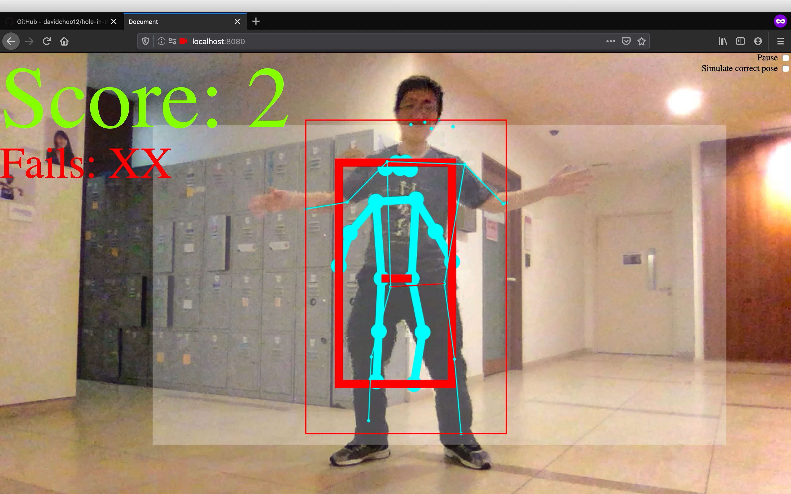

# Hole in the Wall game

A browser game reminiscent of [Hole in the Wall](<https://en.wikipedia.org/wiki/Hole_in_the_Wall_(American_game_show)>) gameshow powered by [Tensorflow Pose Estimation library (aka Posenet)](https://www.tensorflow.org/lite/models/pose_estimation/overview).

[Try out the demo!](https://davidchoo12.github.io/hole-in-the-wall-game/)

This project is a [submission for Hack&Roll 2020](https://devpost.com/software/hole-in-the-wall-game-using-tensorflow-pose-estimation) which wins **The Most Entertaining Hack!**

## Getting Started

### Installing

`npm install`

### Serving the repository on localhost

You can use any tool that does this.

- Since node js is presumably installed, you may run `npm install http-server -g` to install [http-server](https://www.npmjs.com/package/http-server) globally, then run `http-server -p 8080` in the project directory
- Alternatively, if you have python 3 installed, you can run `python -m http.server 8080`
- Alternatively, if you have ruby intalled, you can run `ruby -run -e httpd . -p 8080`

Once it is running, you can just go to http://localhost:8080/ and try it out. It should request for access to the camera/webcam to which you can just accept it. Note that starting up will most likely take a few seconds to load the video, depending on your GPU.

The pose estimation is all running locally, so there is no further communication to any server after loading of the necessary scripts. You can check out the network tab in your browser devtools, so your video feed is not being uploaded at all.

Make sure only 1 person is in the camera view when it is running, as I am using single pose detection for the sake of the game (I only support single player).

## index.html

As this is a hackathon, I coded most of the application in this monolithic file. Most of the code are adapted from [posenet's demo camera.js](https://github.com/tensorflow/tfjs-models/blob/master/posenet/demos/camera.js), [demo_utils.js](https://github.com/tensorflow/tfjs-models/blob/master/posenet/demos/demo_util.js) and analysing [the actual demo](https://storage.googleapis.com/tfjs-models/demos/posenet/camera.html).

Here I will briefly explain what the code does.

1. Selectively include functions dependencies from demo_utils.js which are specified [here](https://github.com/tensorflow/tfjs-models/blob/72787aa4d4af9e5cea4c31d11db412355b878b70/posenet/demos/camera.js#L21).
2. Include [samplePoses.js](./samplePoses.js). This specifies an array of predefined poses which are manually captured by logging the poses and stopping the requestAnimationFrame loop. The poses are made by myself, [Bing Huang](https://github.com/BingHuang-Chin) and [Zainul](https://github.com/zainul1996).
3. Load camera/webcam feed into the video source to display what it sees.
4. Initialize posenet and run the poseDetectionFrame in a requestAnimationFrame loop. The game logic is all in the poseDetectionFrame function.
5. poseDetectionFrame will draw 2 overlays on a canvas: the wall with the expected pose zooming in, and the detected a single pose from the camera feed.
6. When the wall is zoomed in 100%, the expected pose is compared with the detected pose using a [pose similarity algo library](https://github.com/freshsomebody/posenet-similarity) to decide whether to score or fail.
7. When the player fails 3 times, the game stops. Reload the browser to replay.

## Challenges I faced

Tensorflow js pose estimation does not have a API documentation. So I had to manually analyse and experiment with the demo source code.

I was stucked for some time on combining HTML5 canvas context [scaling](https://developer.mozilla.org/en-US/docs/Web/API/CanvasRenderingContext2D/scale) and [translations](https://developer.mozilla.org/en-US/docs/Web/API/CanvasRenderingContext2D/translate) to create the zoom in effect originating from the middle. The canvas context's origin is at the top left corner, so scaling is relative to the top left corner and will shift the wall away/towards the corner. So some maths is involved to solve this issue.

## Built With

- [Tensorflow Pose Estimation](https://www.tensorflow.org/lite/models/pose_estimation/overview) - Generates coordinates of a pose skeleton
- [PosenetSimilarity](https://github.com/freshsomebody/posenet-similarity) - Calculates similarity between 2 poses
- [HTML5 canvas](https://developer.mozilla.org/en-US/docs/Web/API/Canvas_API) - Drawing skeletons and bounding boxes overlay

## Contributing

I will be honest, this project is littered with bad practices but hey its from a hackathon :p
So if you can understand my code and want to contribute or fork it out, feel free to do so! If you do, please let me know as I will be interested in what you will do with it.

## Authors

- **David Choo** - _Quick 24 hour hack_

## License

This project is licensed under the MIT License - see the [LICENSE](LICENSE) file for details

## Acknowledgments

- Another year of amazing [Hack&Roll 2020](https://hacknroll.nushackers.org/) for giving me an opportunity to learn something new over the weekend.
